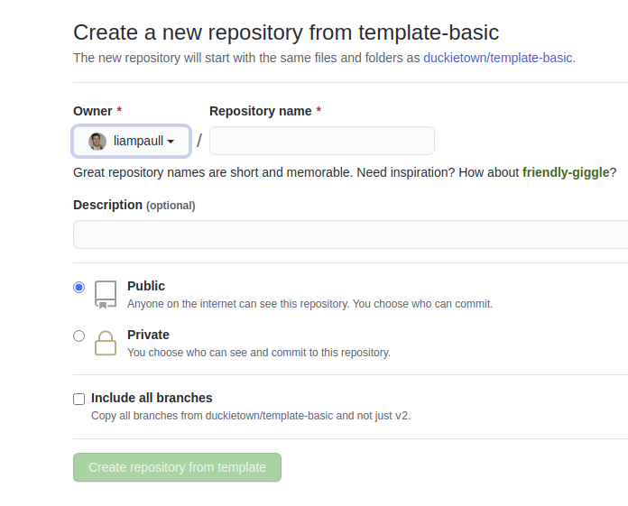

# My First Duckietown Python Library {#python-library status=ready}

Excerpt: Learn how to do proper python development 

## Get the duckietown library template

A boilerplate is provided by the [library template repository](https://github.com/duckietown/template-library).

The repository contains a lot of files, but do not worry, we will analyze them one by one. Click on the green button that says "Use this template". 

<figure>
  
</figure>

This will take you to a page that looks like the following:

<figure>
  
</figure>

Pick a name for your repository (say `my-library`) and press the button *Create repository from template*. Note, you can replace `my-library` with the name of the repository that you prefer.

This will create a new repository and copy everything from the repository `template-library` to your new repository. You can now open a terminal and clone your newly created repository.

    laptop $ git clone https://github.com/![YOUR_NAME]/my-program
    laptop $ cd my-program

Note: Replace `YOUR_NAME` in the link above with your GitHub username.

## Features of the library template

We have the following features:

* Unit-tests using [Nose].
* Building/testing in Docker environment locally.
* Integration with [CircleCI] for automated testing.
* Integration with [CodeCov] for displaying coverage result.
* Integration with [Sphinx] to build code docs. (So far, only built locally.)
* [Jupyter] notebooks, which are run also in CircleCI as tests.
* Version bump using [Bumpversion].
* Code formatting using [Black].
* Command-line program for using the library.

[CodeCov]: https://codecov.io/gh/duckietown
[Sphinx]:  https://www.sphinx-doc.org/en/master/
[Black]: https://github.com/psf/black
[CircleCI]: https://circleci.com/gh/duckietown
[Jupyter]:  https://jupyter.org/
[Bumpversion]: https://github.com/peritus/bumpversion
[Nose]: https://nose.readthedocs.io/en/latest/

## Anatomy of the library template

This repository describes a library called "`duckietown_pondcleaner`" and there is one command-line tool called `dt-pc-demo.`

### Meta-files

* `.gitignore`: Files ignore by Git.

* `.dtproject`: Enables the project to be built and used by `dts devel` tools

* `.bumpversion.cfg`: Configuration for bumpversion

* `Makefile`: Build tools configuration with Make

### Python packaging

* `requirements.txt`: Contains the *pinned* versions of your requirement that
  are used to run tests. 
   
* `MANIFEST.in`: Deselects the tests to be included in the egg.
 
* `setup.py`: Containes meta information, definition of the scripts, and 
  the dependencies information.  

### Python code

* `src/` - This is the path that you should set as "sources root" in your tool

* `src/duckietown_pondcleaner`: Contains the code.

* `src/duckietown_pondcleaner/__init__.py`: Contains the `__version__` library.

* `src/duckietown_pondcleaner_tests`: Contains the tests - not included in the egg.

### Docker testing

These are files to build and run a testing container.

* `.dockerignore`: Describes what files go in the docker container.

* `Dockerfile`: ...

### Sphinx

* `src/conf.py`: Sphinx settings

* `src/index.rst`: Sphinx main file

* `src/duckietown_pondcleaner/index.rst`: Documentation for the package

### Coverage

* `.coveragerc`: Options for code coverage. 

### Notebooks

* `notebooks`: Notebooks that are run also as a test.

* `notebooks-extra`: Other notebooks (not run as test)

* `notebooks/*.ipynb`: The notebooks themselves.

## Creating your Library 

Using the repo you have already created:

- Clone the newly created repository;
- Place your Python packages inside `src/`;
- List the python dependencies in the file `dependencies.txt`;
- Update the appropriate section in the file `setup.py`;

Make sure that there are no other remains:

    laptp $ grep -r . pondcleaner

Update the branch names in `README.md`.

### Other set up (for admins)

The following are necessary steps for admins to do:

1. Activate on CircleCI. Make one build successful.

2. Activate on CodeCov. Get the `CODECOV_TOKEN`. Put this token in CircleCI environment. 

## How to use the utilities in the library template

### Test the code

Test the code using Docker by:

    laptop $ make test-docker
    
This runs the test using a Docker container built from scratch
with the pinned dependencies in `requirements.txt`.
This is equivalent to what is run on CircleCI.

To run the tests natively, use:

    laptop $ make test 

### Development

We assume you have already setup a Python virtual environment.

Note: To do so you will need to `pip install virtualenv` then `virtualenv duckietown` then `source duckietown/bin/activate`

Then we suggest you run:

    laptop $ python setup.py develop 
    
This will install the library in an editable way (rather than copying the sources somewhere else).

If you don't want to install the deps, do:

    laptop $ python setup.py develop  --no-deps
    
For example, this is done in the Dockerfile so that 
we know we are only using the dependencies in `requirements.txt` with the 
exact pinned version.

 
### Adding tests

To add another tests, add files with the name `test_*py` in the 
package `duckietown_podcleaner_tests`. The name is important.

Tip: make sure that the tests are actually run looking at the coverage results.

### Notes on using the notebooks

Always clean the notebooks before committing them:

    laptop $ make -C notebooks cleanup

If you don't think you can be diligent, then add the notebooks using Git LFS.

### Releasing a new version

#### Updating the version

The first step is to change the version and tag the repo. 
**DO NOT** change the version manually; use the CLI tool `bumpversion` instead.

The tool can be called by:

    laptop $ make bump    # bump the version, tag the tree
    
If you need to include the version in a new file, list it inside the file `.bumpversion.cfg` using the
syntax `[bumpversion:file: &lt;FILE_PATH &gt;]`.

#### Releasing the package

The next step is to upload the package to PyPy. 
We use [twine](https://pypi.org/project/twine/). Invoke using: 
 
    laptop $ make upload  # upload to PyPI

For this step, uou need to have admin permissions on PyPy.
