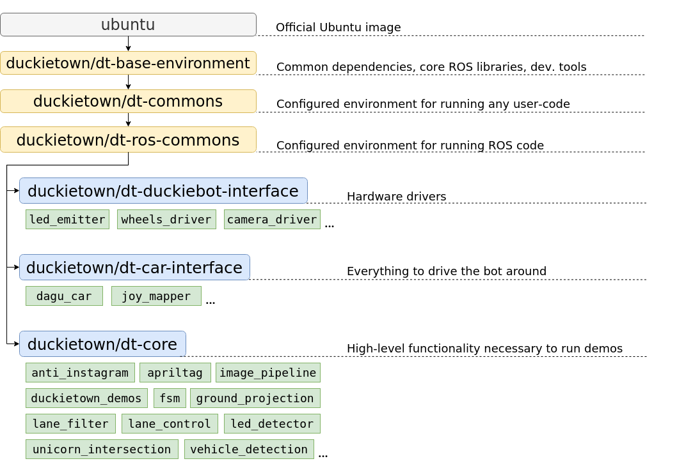
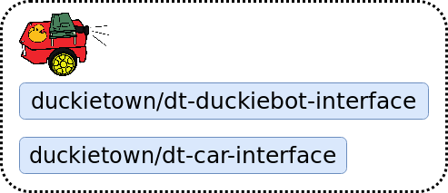
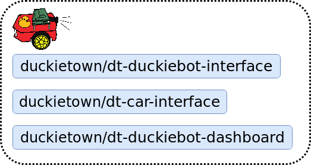
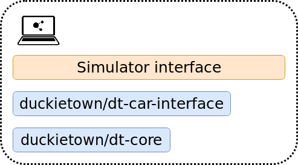
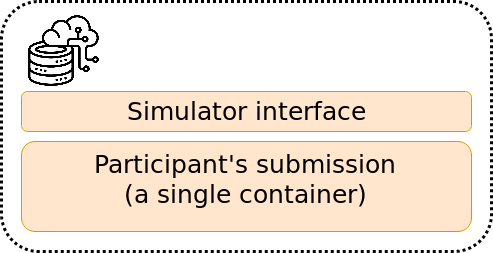
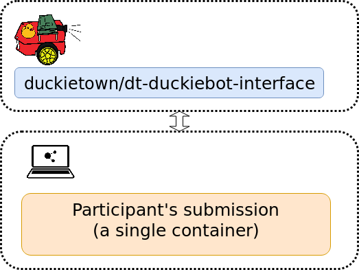

# Duckietown code structure {#duckietown-code-structure status=ready}

Excerpt: Learn how the Duckietown code is organized.

In order to develop new functionality within the Duckietown eco-system you need to know how the existing code is structured. This module will introduce you to the top-level structure and the references that can help you to find out more.

While on the outside Duckietown seems to be all about a simple toy car with some duckies on top, once you dive deeper you will find out that it is much bigger on the inside (just like a TARDIS). It's not only about cars, but also boats and drones. And you can run the same code on a real Duckiebot, in simulation, or in a competitive AI Driving Olympics environment. You can also use some of the dozens of projects done before. As we clearly cannot cover everything in a concise way, this module will instead focus only on the code that runs on a Duckiebot during the standard demos, e.g. Lane Following and Indefinite Navigation.

  Requires: [Docker basics](#docker-basics)

  Requires: [ROS basics](#part:sw-advanced)
  
  Results: Knowledge of the software architecture on a Duckiebot 

<minitoc/>

## Main images and repositories{status=ready}

You probably noticed three container and image names popping up when you were running the demos, calibrating your Duckiebot, or developing some of the previous exercises: `dt-duckiebot-interface`, `dt-car-interface`, and `dt-core`. You probably wonder why there are three of these and what each one of them does?

Let's first look at the bigger picture: The container hierarchy in Duckietown.

<figure> 
  <figcaption>Docker image hierarchy</figcaption>
  
</figure>

As you can see in the above image, all three of the containers actually inherit the same container. Recall that 'inheritance' in a Docker images means that the 'child' image has a `FROM` statement with the 'parent' image.

The image from which everything starts is `ros:kinetic-ros-base-xenial`. It is an official ROS image that is configured to work smoothly with ROS Kinetic. Even though this image is already extremely powerful, it is not well suited to directly work on a Duckiebot. Therefore, we add a few additonal components and configure it properly which results in `duckietown/dt-ros-kinetic-base`.

The `duckietown/dt-ros-kinetic-base` image has everything you need in order to start developing code that directly works on your Duckiebot. However, as there are a few components that all Duckietown ROS nodes share, it is convient to package them in an image. These are `duckietown-utils` (a library with a number of useful functions), `duckietown_msgs` (a ROS package that contains all the ROS message types used in Duckietown), and `DTROS`. `DTROS` is a 'mother' node for all other nodes in Duckietown. We will look at it in more detail soon.

We finally can focus on `dt-duckiebot-interface`, `dt-car-interface`, and `dt-core`. The first, 
`dt-duckiebot-interface`, contains all the hardware drivers you need to operate your Duckiebot. In particular these are the drivers for the camera (in the `camera_driver` package), the ones for the motors (`wheels_driver`), and the LED drivers (`led_emitter`). Thanks to these nodes, you don't need to interact with low level code to control your Duckiebot. Instead, you can simply use the convenient ROS topics and services provided by these nodes.

The `dt-car-interface` image provides additional basic functionality that is not on hardware level. It is all you need to be able to drive your Duckiebot around, in particular the parts that handle the commands sent by a (virtual) joystick (the `joy_mapper` package) and the forward and inverse kinematics that convert the desired robot movement to wheel commands (`dagu_car` package). It might not be immediately clear at first why these are not part of `dt-duckiebot-interface` or `dt-core`. In some use cases, e.g. for the demos or controlling a robot via a joystick, it is beneficial to have these two packages. For others, e.g. when deploying a completely different pipeline, e.g. end-to-end reinforcement learning, one would prefer to interact directly with the drivers. We will see more examples of use cases shortly.

The `dt-core` image provides all the high level robot behavior that you observe when running a demo. The image processing pipeline, decision-making modules, lane and intersection contollers, and many others reside there. 

If you are curious to see all the ROS packages available in each of these images, you can check out the corresponding GitHub repositories:

Note: Make sure to look at the `daffy` branches of these repositories!

- [`dt-ros-kinetic-base`](https://github.com/duckietown/dt-ros-kinetic-base/tree/daffy)
 
- [`dt-ros-commons`](https://github.com/duckietown/dt-ros-commons/tree/daffy)

- [`dt-duckiebot-interface`](https://github.com/duckietown/dt-duckiebot-interface/tree/daffy)

- [`dt-car-interface`](https://github.com/duckietown/dt-car-interface/tree/daffy)

- [`dt-core`](https://github.com/duckietown/dt-core/tree/daffy)

As you will see in the nodes, there's a lot of inline documentation provided. You can also access it [here](http://rosapi.duckietown.p-petrov.com) in a more readable form. 

Note: Unfortunately, for the moment only `dt-ros-commons`, `dt-duckiebot-interface`, and `dt-car-interface` are documented. We are working on providing similar level of documentation for `dt-core` as well.

## Various configurations of the Duckietown codebase

As we already mentioned, the Duckietown codebase can be used in various configurations: on a physical robot, in simulation, as an AI Driving Olympics submission, etc. Depending on how you want to deploy or use your code, you will be using different Docker images. Here we will take a look at a some of the most common use cases.

### Driving with a (virtual) joystick

If you only want to drive your Duckiebot around, you need the `joy_mapper` node that translates the joystick `Joy` messages to car command messages, the `kinematics` node that in turn converts these to wheel command messages, and the `wheels_driver` node that controls the motors. So the `dt-duckiebot-interface` and `dt-car-interface` images are enough.

<figure> 
  <figcaption>Driving with a (virtual) joystick</figcaption>
  
</figure>

### Driving through the Dashboard

As you have already [seen](#basic-db-operation), the Dashboard and the Compose interface also provide manual driving functionality. For this, one needs the same images as before, of course together with the Dashboard image itself:

<figure> 
  <figcaption>Driving through the Dashboard</figcaption>
  
</figure>

### Running a demo on a Duckiebot

Running a demo requires to drive around together with the high-level processing and logic that reside in the `dt-core` image:

<figure> 
  <figcaption>Running a demo on a Duckiebot</figcaption>
  
</figure>

### Running a demo in simulation

A demo can also be executed in simulation. In this case, instead of using the hardware drivers `dt-duckiebot-interface` provides, we substitute them with the simulator interface: 

<figure> 
  <figcaption>Running a demo in simulation</figcaption>
  
</figure>

### Evaluating AIDO submissions in simulation

An AI Driving Olympics submission is essentially a container that receives image data and outputs wheel commands. Therefore, it can replace the `dt-car-interface` and `dt-core` images and still use the same simulator framework. This can also be done in the cloud, and that is exactly how AIDO submissions get evaluated in simulation on the [challenges server](https://challenges.duckietown.org).
 
<figure> 
  <figcaption>Evaluating AIDO submission in simulation</figcaption>
  
</figure>

### Evaluating AIDO submissions on a Duckiebot

The same submission image, with not a single change, can be also tested on a real Duckiebot! Simply substitute the simulator with the `duckiebot-interface`. As the containers don't need to run on the same device, we can also use much powerful computers (also state-of-the-art GPUs) when testing submissions. This is the way that AIDO submissions get evaluated in Robotariums. In this way, even if you don't have a Duckiebot, you can develop your submission in simulation, then submit it to be evaluated in simulations on the challenges server, and if it performs well, you can request remote evaluation on a real Duckiebot in a Robotarium!
 
<figure> 
  <figcaption>Evaluating AIDO submission on a Duckiebot</figcaption>
  
</figure>
