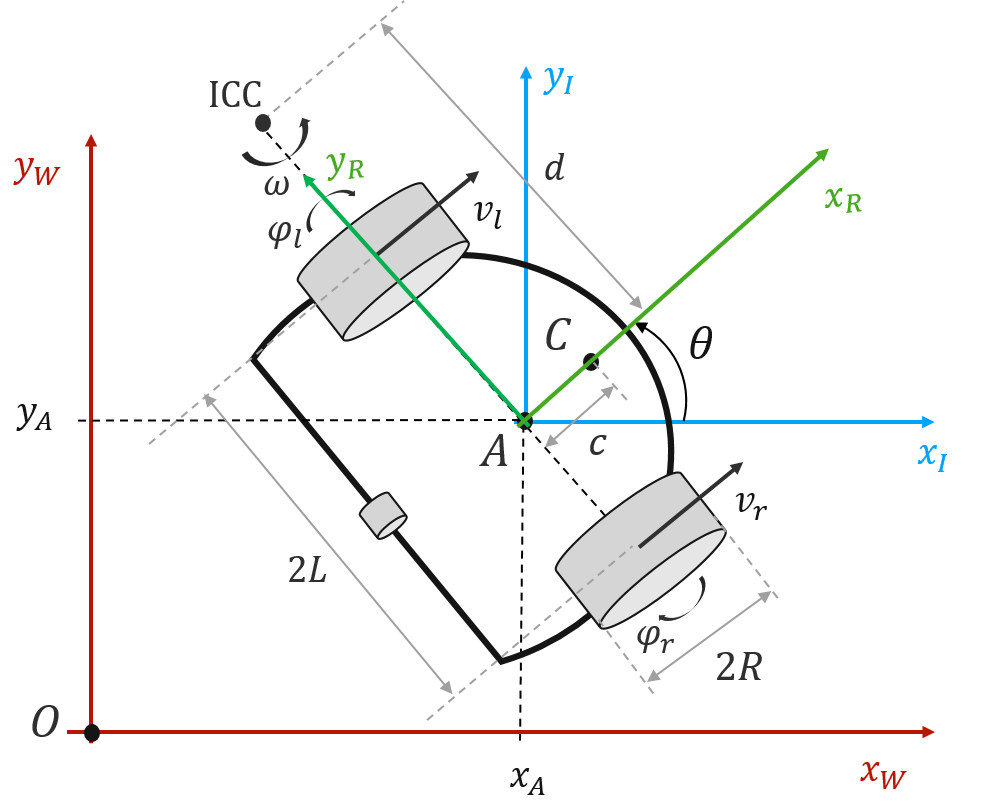
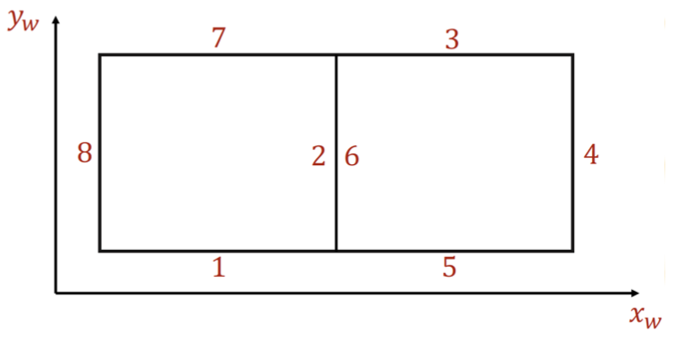

# Odometry with Wheel Encoders {#odometry-calibration-encoders status=draft}

Excerpt: Odometry Calibration for your Duckiebot

  Requires: [Working with Encoders](#odometry-modeling)

  Results: Use the Wheel Encoders to Obtain a Better Calibration for your Duckiebot.

## Odometry Calibration

As seen in the previous section, the differential drive model used for the Duckiebot depends on several parameters, which can be updated for better performance. In this exercise, we will perform calibration of the Duckiebot using the wheel encoders, and hopefully obtain a more accurate model which allows for controlling the Duckiebot without the camera.

### Mathematical Representation

The complete mathematical model for the Duckiebot can be found [here](#duckiebot-modeling). The model can be expressed in terms of some calibration parameters $$ p $$, state $$ x $$ and inputs $$ u $$.

$$ \dot{x} = f(p;x,u) $$
$$ y = g(x) $$

Where $$ f(\dot{}) $$ is the constrained kinematic model, and $$ g(\dot{}) $$ is the robot pose.

To obtain the calibration parameters $$ p $$, we can use the wheel encoders. The wheel encoders measure a `tick` every $$ \Delta{\phi} $$ which is the change in angular position. From this representation, the distance travelled by each wheel (independently) can be measured with the following formula:
$$ \Delta X = 2*\pi * R * {N_{ticks}/N_{total}} $$

Thus, the kinematic model for the Duckiebot can be written in terms of the distance traveled in a given time interval $$ \Delta t $$, and is shown as $$ d $$.

The Duckiebot model is shown below:

  

The kinematics model (for linear and angular velocity of point A), is then written as:

$$ v_A = \frac{v_r + v_l}{2} $$

$$ \dot{\theta} = \frac{v_r - v_l}{2L} $$

$$ \Delta{\theta} = \frac{d_r - d_l}{2L} $$

Thus the model, in global coordinates, can be written as:

$$ x(t+\Delta{t}) = x(t) + d \cos(\theta)   $$
$$ y(t+\Delta{t}) = y(t) + d \sin(\theta)    $$
$$ \theta(t+\Delta{t}) = \theta(t) + \frac{d_r - d_l}{2L}  $$

Where $$ x $$ is the world displacement in the x-direction, $$ y $$ is the y-displacement in the y direction, and $$ \theta $$ is the robot's orientation.

### Calibration Methodology

From the known parameters, we can now derive a method for calibration which depends only on $$ p $$. The goal is to determine the parameters by mapping real-world position to some virtual coordinates (in the robot's reference frame).

The method to do this is to follow a predetermined pattern on the ground, with known coordinates. This could be a series of lines on the floor, or the Duckietown which you have at home or at the lab. The robot will move on this predetermined pattern, and at every point, you will compare the ground truth (world reference frame as fixed in the real world) to the virtual representation of the Duckiebot.

A proposed pattern is shown below, where every segment is 50 cm. The goal is to manually drive the Duckiebot (as good as possible) through each keypoint (corners), and then map the measured coordinates from the encoders to the real-world coordinates using least squares regression.

  

You should get two series of datapoints:
- $$ q $$ obtained from the known world frame, driving parallel to line on points.
- $$ \hat{q} = {x(t), y(t), \theta(t)} $$ which is obtained from the kinematics model of the Duckiebot as shown in the Mathematical representation section.

#### Odometry Calibration Exercise {#exercise:extracting-model-parameters}

Do the following:

- Create a copy of the Duckietown ROS template or use your template from the previous exercise.

- Run Keyboard control and manually control your Duckiebot.

- Create a virtual representation of the Duckiebot's position in the global frame (initialized at zero wherever you place it first).

- Track the Duckiebot's inferred position from the encoders, and contrast it with the ground truth.

- Perform Least Squares to determine model parameters $$ p := (R_l, R_r, L) $$.

- Update configuration parameters using `rosparam set`. For the radius, take the average between the two found values.

- Take a video of your Duckiebot moving on a single line trajectory, and upload a rosbag containing the measured $$ x $$, $$y$$, and $$\theta$$ values and their timestamp.

Deliverable 1: Screenshot of the updated `/data/config/calibrations/kinematics/HOSTNAME.yaml` file.

Deliverable 2: Video of your Duckiebot following a defined trajectory (0,0) to (0,X). And a rosbag containing the $$ x $$, $$y$$, and $$\theta$$ values corresponding to your video.

<end/>
